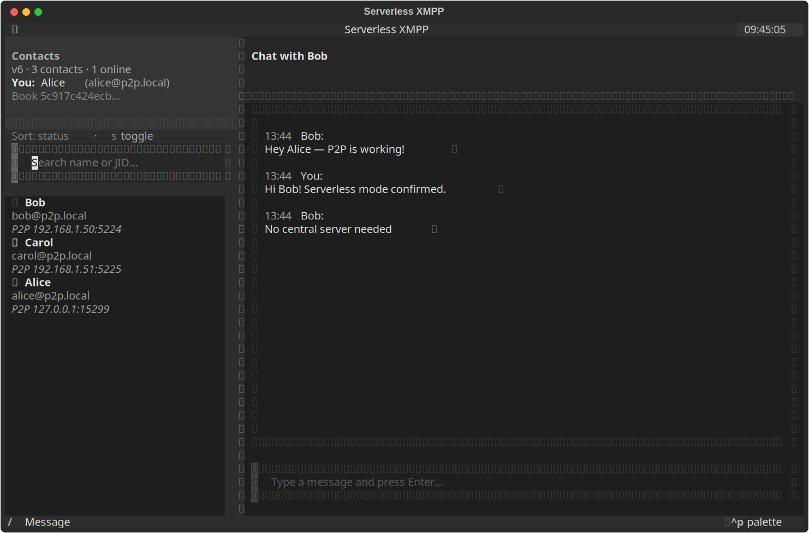
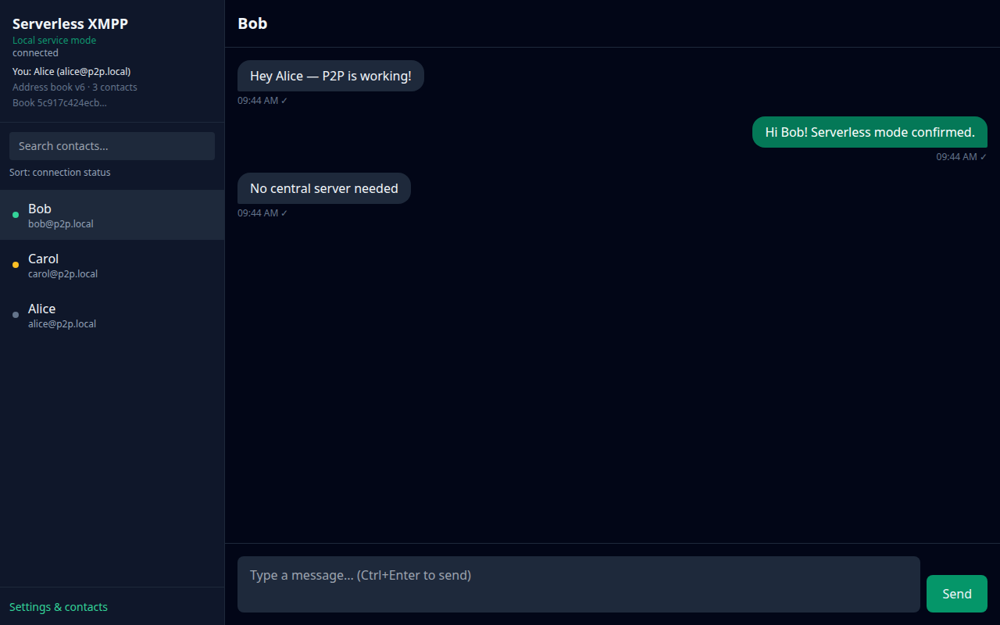

# serverless-xmpp

**A privacy-first, serverless XMPP chat client with a decoupled connection service and multiple user interfaces (text TUI + modern web SPA).**

Uses pre-placed local address books to start peer-to-peer chats over **direct TLS streams** (default), with optional fallback to a traditional XMPP server. Built for trusted circles who want control over their data and infrastructure.

> **Status**: MVP with **direct P2P (serverless) transport**, address book packaging with version/hash verification, TUI address book management, and PyInstaller distribution.

## Key Features

- **Pre-placed Address Books** — Local JSON files (human-editable) define your contacts. Version + SHA256 hash with visual 8×8 fingerprint grid **while awaiting connection**; compact hash prefix when connected. Bundled default imported on first run.
- **Decoupled Architecture** — Connection Service handles all XMPP logic, transports, sessions, and persistence. UIs are thin clients.
- **Multiple UIs**:
  - Keyboard-first **Text TUI** (Textual) — chat, contact search/sort, local identity in sidebar, full address book screen (`a`), create/remove contacts.
  - Modern **Web SPA** (Svelte + Vite + Tailwind) — rich chat experience, connection-aware sidebar, settings panel with full hash grid and reload.
- **Serverless Operation** — Direct P2P over TLS without a central server; optional XMPP server client mode for Prosody/ejabberd.
- **Offline Resilience** — Message queuing, local history (SQLite), automatic retry.
- **Privacy & Security** — Local data only, TLS enforced, localhost-only API, no telemetry.
- **Packaging** — PyInstaller bundle ships bundled address book + embedded Web UI ([docs/packaging.md](docs/packaging.md)).
- **Extensible** — Pluggable transports; mDNS LAN discovery; easy to add E2EE and new UIs.

## Screenshots

| Text TUI (Textual) | Web SPA (Svelte) |
|---|---|
|  |  |

Regenerate with `./scripts/capture-screenshots.sh` (requires a running Connection Service and `playwright` + `cairosvg`). Intermediate `.svg` files are gitignored.

### Text TUI keyboard shortcuts

| Key | Action |
|-----|--------|
| `a` | Open **Address Book** — list contacts, version, hash grid, file path |
| `n` | **New contact** (from main screen or address book) |
| `s` | Toggle contact sort (**presence status** ↔ **name**) |
| `Delete` | Remove selected contact (address book screen) |
| `r` | Refresh contacts / reload address book from disk |
| `Enter` | Open chat with selected contact |
| `c` | Focus contact list |
| `/` | Focus message input |
| `?` | Help overlay |
| `q` | Quit TUI (service keeps running) |

The sidebar shows **who you are** (matched from the address book via `local_jid`), contact count, address book **version** (`v{N}`), and:

- **Awaiting connection** — full **8×8 color hash grid** to verify the distributed contact list before peers connect
- **Connected** — compact hash prefix only; contacts sorted by presence (online first) with search and alphabetical sort toggle

## Quick Start

```bash
git clone https://github.com/mowgli42/serverless-xmpp.git
cd serverless-xmpp

python3 -m venv .venv && source .venv/bin/activate
pip install -e ".[dev]"

mkdir -p ~/.config/xmpp-p2p-chat ~/.local/share/xmpp-p2p-chat
cp examples/config.sample.toml ~/.config/xmpp-p2p-chat/config.toml
cp examples/addressbook.sample.json ~/.local/share/xmpp-p2p-chat/addressbook.json
# Edit config.toml with your XMPP jid/password/server

# Terminal 1: Connection Service
python -m xmpp_p2p_chat.connection_service

# Terminal 2: Text TUI
python -m xmpp_p2p_chat.text_ui

# Terminal 3: Web UI (built into service at http://127.0.0.1:8767 after npm run build)
cd web_ui && npm install && npm run build
# Service auto-serves web_ui/dist when [ui] serve_web = true
```

Full details: [docs/quick-start.md](docs/quick-start.md) · **Architecture**: [docs/architecture.md](docs/architecture.md) · **Display walkthroughs**: [TUI](docs/display-walkthrough-tui.md) / [Web](docs/display-walkthrough-web.md) · **Packaging**: [docs/packaging.md](docs/packaging.md) · **Serverless P2P**: [docs/p2p-serverless.md](docs/p2p-serverless.md)

## Serverless P2P (No XMPP Server)

The default transport is **direct peer-to-peer** — each client listens for inbound TLS connections and connects outbound to contacts listed in the address book:

```bash
cp examples/config.p2p-alice.toml ~/.config/xmpp-p2p-chat/config.toml
cp examples/addressbook.p2p-alice.json ~/.local/share/xmpp-p2p-chat/addressbook.json
# Share TLS fingerprints out-of-band, update addressbook direct.public_key_fingerprint

python -m xmpp_p2p_chat.connection_service
```

See [docs/p2p-serverless.md](docs/p2p-serverless.md) for the full two-peer setup.

## Multi-Client Testing

Test two users (alice ↔ bob) with a local Prosody server:

```bash
./scripts/test-multi-client.sh setup      # Start Docker Prosody + test accounts
./scripts/test-multi-client.sh init-alice # Write alice config
./scripts/test-multi-client.sh init-bob   # Write bob config
./scripts/test-multi-client.sh service-alice  # Terminal 1
./scripts/test-multi-client.sh service-bob    # Terminal 2
```

See [docs/multi-client-testing.md](docs/multi-client-testing.md).

## Architecture Overview

```
UIs (Text TUI / Web SPA)
        ↓ WebSocket + JSON-RPC (localhost)
Connection Service (Python)
  ├─ Address Book (JSON + version/hash)
  ├─ SQLite persistence
  └─ Pluggable transports
        ↓                    ↓
Direct P2P peers      External XMPP server
(TLS + XML streams)   (slixmpp client)
```

Diagrams and sequence charts: [docs/architecture.md](docs/architecture.md)

## Project Structure

```
serverless-xmpp/
├── src/xmpp_p2p_chat/
│   ├── connection_service/   # Core daemon, transports, WebSocket API
│   ├── text_ui/              # Textual TUI + address book screens
│   ├── share/                # Bundled default addressbook.json
│   └── common/               # Config, models, hash helpers, API client
├── web_ui/                   # Svelte 5 SPA (HashGrid, settings)
├── tests/                    # pytest unit + API integration tests
├── docs/diagrams/            # Architecture PlantUML sources + PNGs
├── docker/                   # Prosody for local testing
├── packaging/                # PyInstaller spec + launcher
├── scripts/                  # Test harness, screenshot + diagram render
├── examples/                 # Sample config + addressbook
└── openspec/                 # Spec-driven development artifacts
```

## Development

```bash
pytest tests/ -v
cd web_ui && npm test
ruff check src tests
```

This project follows the [OpenSpec](https://github.com/Fission-AI/OpenSpec) workflow. See `AGENTS.md` and `openspec/changes/serverless-xmpp-p2p-chat-client/tasks.md`.

### Tech Stack

- **Python 3.12+** + `slixmpp`, `textual`, `websockets`, `aiosqlite`, `pydantic`
- **Web UI**: Vite + Svelte 5 + Tailwind CSS
- **API**: WebSocket + JSON-RPC 2.0 (localhost only)
- **Persistence**: SQLite + JSON/TOML

## Status & Roadmap

- [x] OpenSpec requirements & design
- [x] MVP: Connection Service + Address Book + Persistence + XMPP transport
- [x] MVP: WebSocket JSON-RPC API
- [x] MVP: Text TUI + Web SPA
- [x] Multi-client test harness (Docker Prosody + scripts)
- [x] MVP: Direct P2P transport (TLS + XMPP streams, mutual peer connections)
- [x] mDNS LAN discovery (zeroconf)
- [x] TUI address book screen (create, view, remove, hash grid)
- [x] Address book packaging — bundled import, version/hash, visual fingerprint
- [x] PyInstaller packaging & distribution ([docs/packaging.md](docs/packaging.md))
- [x] Embedded web UI server
- [ ] Per-chat E2EE (stretch)

## License

MIT License — see `LICENSE` file.

---

*Privacy-respecting communication for people who value control.*
