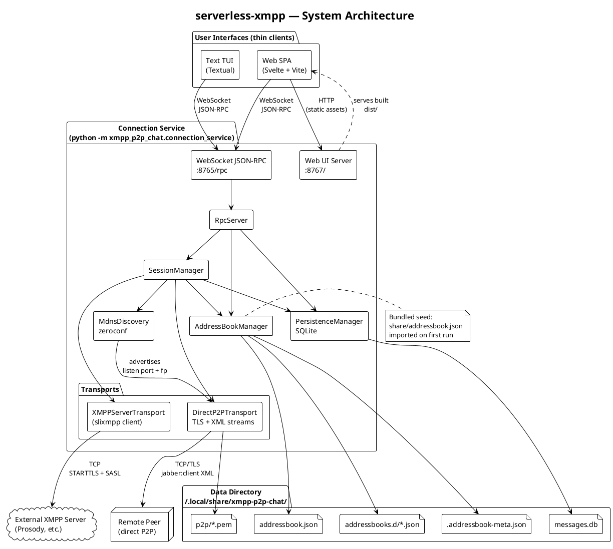
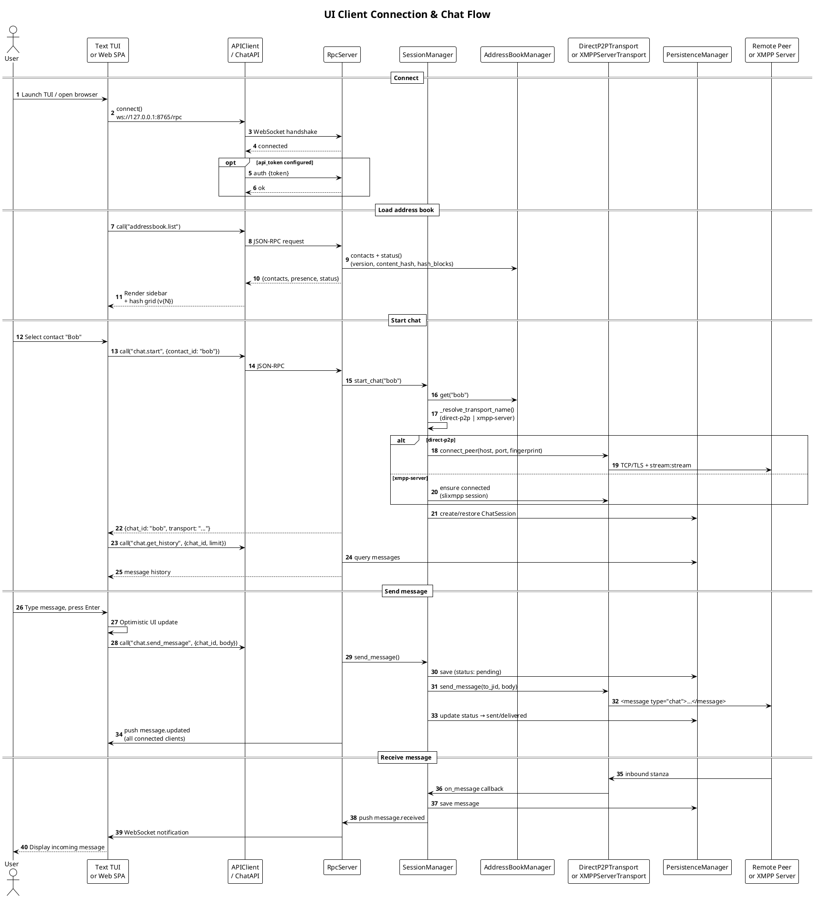
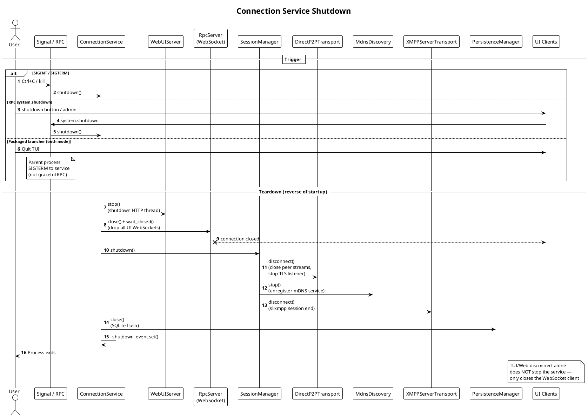

# Architecture & Implementation Overview

This document describes what **serverless-xmpp** (`xmpp-p2p-chat`) implements today: system architecture, XMPP-related standards coverage, lifecycle sequences, and the address book format.

For operational guides see [quick-start.md](quick-start.md), [p2p-serverless.md](p2p-serverless.md), [api.md](api.md), and [packaging.md](packaging.md).

---

## 1. What We Have Implemented

### Design philosophy

The project is **not** an XMPP server. It is a **local Connection Service** that owns all messaging logic, plus **thin UIs** (Text TUI and Web SPA) that talk to the service over a localhost WebSocket JSON-RPC API.

Contacts come from a **local address book** (JSON files), not from a server roster. This supports trusted circles who distribute contact lists out-of-band and want full control over their data directory.

### Core components

| Component | Role |
|-----------|------|
| **Connection Service** | Orchestrates address book, SQLite persistence, transport sessions, WebSocket RPC, and optional embedded Web UI |
| **Address Book Manager** | Loads/merges JSON contact files, tracks version + SHA256 content hash, imports bundled defaults on first run |
| **Session Manager** | Routes chats to the correct transport, manages active sessions, drains offline outbox |
| **Direct P2P Transport** | TLS-encrypted TCP with minimal `jabber:client` XML streams between peers (default mode) |
| **XMPP Server Transport** | slixmpp client to an external XMPP server (Prosody, ejabberd, etc.) as fallback |
| **mDNS Discovery** | LAN advertisement and browsing for P2P peers (`_xmpp-p2p._tcp.local.`) |
| **Persistence** | SQLite for message history, active chats, presence cache, and pending outbox |
| **Text TUI** | Textual-based terminal client |
| **Web SPA** | Svelte + Vite chat UI served from the service at `http://127.0.0.1:8767/` |

### Key capabilities shipped

- **Pre-placed address books** — human-editable JSON; optional fragment files in `addressbooks.d/`
- **Startup address book processing** — load, merge, bundled import, canonical hash, version tracking
- **Visual hash fingerprint** — 8×8 color grid in TUI sidebar and Web UI settings (verify distribution integrity)
- **Direct P2P messaging** — inbound TLS listener + outbound connections; fingerprint pinning
- **XMPP server mode** — connect to external server via slixmpp with STARTTLS + SASL
- **Offline resilience** — message outbox with retry on transport reconnect
- **Multi-UI sync** — push events over WebSocket (`addressbook.updated`, `message.received`, etc.)
- **Packaging** — PyInstaller bundle with bundled address book and embedded Web UI (`docs/packaging.md`)
- **34 automated tests** — unit, transport, API, and integration coverage

---

## 2. XMPP Standards & Protocol Support

### Summary

| Area | Support level | Notes |
|------|---------------|-------|
| **RFC 6120** (XMPP Core — streams) | Partial | P2P uses minimal `stream:stream` open/close; no feature negotiation or resource binding |
| **RFC 6121** (IM & Presence) | Partial | `message type="chat"` with `<body>`; bare `<presence>` with `<show>` / `<status>` |
| **RFC 6122** (JID format) | Yes | Validated in contact model (`user@domain`) |
| **RFC 7395** (WebSocket binding) | No | Local API uses WebSocket JSON-RPC, not XMPP-over-WebSocket |
| **XEP-0174** (Serverless Messaging) | Inspired | TLS + direct streams; no full XEP-0174 negotiation or link-local discovery |
| **XEP-0030** (Service Discovery) | Registered only | slixmpp plugin loaded; no app-level usage |
| **XEP-0199** (XMPP Ping) | Yes (server mode) | Available via slixmpp on XMPP server transport |
| **SASL** | Server mode only | slixmpp handles PLAIN (etc.) after STARTTLS |
| **TLS** | Yes | P2P: raw TLS 1.2+ with self-signed certs + SHA256 pinning; Server: STARTTLS via slixmpp |
| **Roster (RFC 6121)** | No | Replaced by local address book |
| **Federation (s2s)** | No | No server component |
| **MUC (XEP-0045)** | No | 1:1 chat only |
| **MAM (XEP-0313)** | No | Local SQLite history only |
| **Carbons (XEP-0280)** | No | |
| **OMEMO / E2EE (XEP-0384)** | No | Transport encryption only (TLS) |
| **Delivery receipts (XEP-0184)** | No | Local delivery status only |
| **File transfer / Jingle** | No | |

### Direct P2P transport (default)

Uses namespaces from RFC 6120:

- `jabber:client`
- `http://etherx.jabber.org/streams`

Stanza types handled on the wire:

```xml
<!-- Stream open -->
<stream:stream xmlns='jabber:client' xmlns:stream='http://etherx.jabber.org/streams'
               from='alice@p2p.local' to='bob@p2p.local' version='1.0'>

<!-- Chat message -->
<message xmlns='jabber:client' type='chat' id='...' from='...' to='...'>
  <body>Hello</body>
</message>

<!-- Presence -->
<presence xmlns='jabber:client' from='...' to='...'>
  <show>away</show>
  <status>In a meeting</status>
</presence>
```

**Not implemented on P2P streams:** `<stream:features>`, SASL, resource binding, IQ stanzas (ping, disco, etc.), stream restarts.

Identity on P2P links is established by **TLS certificate fingerprint** stored in the address book (`direct.public_key_fingerprint`), not by XMPP SASL.

Implementation: `connection_service/transports/xmpp_stream.py`, `direct_p2p.py`.

### XMPP server transport (fallback)

When configured with a JID and password, the service connects **as a client** to an external XMPP server using **slixmpp**:

- STARTTLS when `enforce_tls = true`
- SASL authentication (password from config, keyring, or per-contact credentials)
- Outgoing chat messages via `send_message(..., mtype="chat")`
- Incoming `chat` and `normal` messages with body
- Presence send/receive (subscription stanzas ignored)
- XEP-0199 ping available

**Not implemented:** per-contact server override (contact `xmpp_server` field exists in schema but transport uses global config), roster sync, MUC, carbons, MAM, OMEMO.

Implementation: `connection_service/transports/xmpp_server.py`.

### Local control plane (not XMPP)

UIs connect to `ws://127.0.0.1:8765/rpc` (default) using **JSON-RPC 2.0** over WebSocket. This is the application's own API — not an XMPP extension. See [api.md](api.md).

### Discovery

LAN peer discovery uses **DNS-SD / mDNS** with a custom service type:

```
_xmpp-p2p._tcp.local.
```

TXT records include `jid`, `fp` (TLS fingerprint), and `transport`. This supplements — but does not replace — address book entries. Implementation: `connection_service/discovery/mdns.py`.

---

## 3. System Architecture



### Data directory layout

| Path | Purpose |
|------|---------|
| `addressbook.json` | Primary contact list (JSON array) |
| `addressbooks.d/*.json` | Optional fragment files merged at load time |
| `.addressbook-meta.json` | Version, content hash, contact count |
| `messages.db` | Chat history, outbox, presence cache |
| `p2p/` | Auto-generated TLS certificate and key for P2P |

Config lives separately (typically `~/.config/xmpp-p2p-chat/config.toml`).

---

## 4. Sequence Diagrams

### 4.1 Application startup (address book processing)

The address book is the **first substantive I/O** during service startup — before SQLite, transports, or the RPC listener.


**When is the address book read?**

| Moment | Action |
|--------|--------|
| Service `start()` step 1 | `process_startup()` — full load, optional bundled import, hash + version |
| UI connects | `addressbook.list` or `addressbook.status` RPC (reads in-memory state) |
| User presses `r` (TUI) or "Reload" (Web) | `addressbook.reload()` — re-reads files from disk |
| CRUD via UI/API | Mutations write JSON atomically, recompute hash, broadcast `addressbook.updated` |

Both UIs display **version** and an **8×8 hash color grid** derived from `content_hash` so operators can visually confirm they received the latest distributed address book.

---

### 4.2 Client connection & chat flow

UIs never speak XMPP directly. They connect to the local RPC endpoint, load contacts (including hash status), then start chats through the Session Manager.



**Push events** keep multiple UIs in sync without polling:

| Event | When |
|-------|------|
| `addressbook.updated` | Contact CRUD, reload; includes `version`, `content_hash` |
| `message.received` | Inbound chat message |
| `message.updated` | Delivery status change |
| `presence.updated` | Contact presence change |
| `connection.changed` | Transport state change |
| `discovery.updated` | mDNS peer list changed |

---

### 4.3 Shutdown



---

## 5. Address Book Format

### 5.1 Storage model

The address book is a **JSON array of contact objects**. There is no wrapper envelope — the file is simply `[ {...}, {...} ]`.

| File | Location | Purpose |
|------|----------|---------|
| Primary | `{data_directory}/addressbook.json` | Main editable contact list |
| Fragments | `{data_directory}/addressbooks.d/*.json` | Optional splits (merged on load; duplicate `id` → warning + skip) |
| Metadata | `{data_directory}/.addressbook-meta.json` | Auto-managed version and hash (do not hand-edit) |
| Bundled default | `src/xmpp_p2p_chat/share/addressbook.json` | Shipped with package; imported when user book is empty |

### 5.2 Contact schema

All fields are validated by Pydantic (`common/models.py`).

| Field | Type | Required | Default | Description |
|-------|------|----------|---------|-------------|
| `id` | string | yes | — | Stable unique key (used as `chat_id`) |
| `jid` | string | yes | — | XMPP JID (`user@domain`, lowercased on load) |
| `name` | string | yes | — | Display name |
| `avatar` | string \| null | no | `null` | Avatar path or URL |
| `tags` | string[] | no | `[]` | Free-form labels |
| `notes` | string | no | `""` | Free-form notes |
| `preferred_transport` | string | no | `"xmpp-server"` | `"direct-p2p"` or `"xmpp-server"` |
| `xmpp_server` | string \| null | no | `null` | Reserved for per-contact server (not yet wired) |
| `direct` | object \| null | no | `null` | Required for P2P — see below |
| `credentials` | object \| null | no | `null` | Per-contact XMPP credentials — see below |
| `created_at` | ISO 8601 datetime | no | auto | Set on creation |
| `updated_at` | ISO 8601 datetime | no | auto | Updated on mutation |

**`direct` object** (for `preferred_transport: "direct-p2p"`):

| Field | Type | Default | Description |
|-------|------|---------|-------------|
| `host` | string | required | Peer IP or hostname |
| `port` | int | `5222` | Peer's inbound TLS listen port |
| `public_key_fingerprint` | string \| null | `null` | `SHA256:HEX...` from peer's cert (out-of-band exchange) |

**`credentials` object** (for XMPP server mode):

| Field | Type | Description |
|-------|------|-------------|
| `username` | string \| null | Override username (rare) |
| `password_ref` | string \| null | Keyring reference, e.g. `keyring:bob-xmpp` |
| `password` | string \| null | Inline password (development only) |

### 5.3 Metadata file (auto-generated)

`.addressbook-meta.json` is written on every startup and after mutations:

```json
{
  "version": 3,
  "content_hash": "SHA256:a1b2c3d4e5f6...",
  "contact_count": 2,
  "updated_at": "2026-07-03T10:00:00+00:00"
}
```

- **version** — monotonic integer; increments when content hash changes since last run
- **content_hash** — SHA256 of canonical JSON (sorted keys, stable contact ordering)
- **hash_blocks** — 64 hex color strings for the 8×8 UI grid (computed at runtime, not stored)

### 5.4 Sample entries

#### Minimal direct P2P contact

```json
[
  {
    "id": "bob",
    "jid": "bob@p2p.local",
    "name": "Bob",
    "preferred_transport": "direct-p2p",
    "direct": {
      "host": "192.168.1.50",
      "port": 5224,
      "public_key_fingerprint": "SHA256:ABCD1234..."
    }
  }
]
```

#### Full entry with tags, notes, and timestamps

From `examples/addressbook.sample.json`:

```json
[
  {
    "id": "bob",
    "jid": "bob@p2p.local",
    "name": "Bob",
    "tags": ["trusted"],
    "notes": "Direct P2P contact — share your cert fingerprint out-of-band",
    "preferred_transport": "direct-p2p",
    "direct": {
      "host": "127.0.0.1",
      "port": 5224,
      "public_key_fingerprint": "SHA256:..."
    },
    "created_at": "2026-07-02T00:00:00Z",
    "updated_at": "2026-07-02T00:00:00Z"
  }
]
```

#### Bundled distribution default (shipped with package)

From `src/xmpp_p2p_chat/share/addressbook.json` — imported on first run when the user data directory is empty:

```json
[
  {
    "id": "bob",
    "jid": "bob@p2p.local",
    "name": "Bob",
    "tags": ["friends"],
    "preferred_transport": "direct-p2p",
    "direct": {
      "host": "192.168.1.50",
      "port": 5224,
      "public_key_fingerprint": "SHA256:REPLACE_WITH_BOB_FINGERPRINT"
    }
  },
  {
    "id": "carol",
    "jid": "carol@p2p.local",
    "name": "Carol",
    "tags": ["work"],
    "preferred_transport": "direct-p2p",
    "direct": {
      "host": "192.168.1.51",
      "port": 5225,
      "public_key_fingerprint": "SHA256:REPLACE_WITH_CAROL_FINGERPRINT"
    }
  }
]
```

#### XMPP server mode contact

```json
[
  {
    "id": "dana",
    "jid": "dana@example.com",
    "name": "Dana",
    "preferred_transport": "xmpp-server",
    "tags": ["team"],
    "credentials": {
      "password_ref": "keyring:dana-xmpp"
    }
  }
]
```

Global XMPP connection settings (`jid`, `password`, `server`) come from `config.toml`; the service connects once via slixmpp and routes server-mode contacts through that session.

#### Two-peer P2P setup (Alice's book listing Bob)

From `examples/addressbook.p2p-bob.json` — Bob's machine would contain Alice's entry with Alice's fingerprint:

```json
[
  {
    "id": "alice",
    "jid": "alice@p2p.local",
    "name": "Alice",
    "preferred_transport": "direct-p2p",
    "direct": {
      "host": "127.0.0.1",
      "port": 5223,
      "public_key_fingerprint": "SHA256:REPLACE_WITH_ALICE_FINGERPRINT"
    }
  }
]
```

### 5.5 Distribution workflow

1. **Author** edits `addressbook.json` (or fragments) and distributes the file to trusted peers (USB, encrypted channel, git, etc.).
2. Each peer places the file in their data directory (or merges fragments into `addressbooks.d/`).
3. On startup (or `addressbook.reload`), the service recomputes the hash and bumps the version if content changed.
4. Peers compare **version numbers** and the **visual hash grid** in TUI/Web UI to confirm they share the same contact list.
5. For P2P, peers must still exchange **TLS fingerprints** out-of-band and fill in `direct.public_key_fingerprint` before connecting securely.

See [packaging.md](packaging.md) for PyInstaller bundle distribution.

---

## 6. Explicitly Out of Scope

The following are documented as future or non-goals (see `openspec/` design docs):

- Multi-user chat (MUC), voice/video (Jingle)
- End-to-end message encryption (OMEMO)
- Public/global peer discovery
- Mobile push notifications
- High availability / clustering
- Full XEP-0174 serverless compliance
- Operating as an XMPP server or federated s2s component

---

## 7. Related Documentation

| Document | Contents |
|----------|----------|
| [api.md](api.md) | JSON-RPC methods and push events |
| [p2p-serverless.md](p2p-serverless.md) | Two-peer P2P setup guide |
| [packaging.md](packaging.md) | PyInstaller bundle and address book hash |
| [quick-start.md](quick-start.md) | Install and first run |
| [multi-client-testing.md](multi-client-testing.md) | Prosody-based multi-client tests |

### Rendering PlantUML diagrams

Paste any `@startuml` block into:

- [PlantUML online server](https://www.plantuml.com/plantuml/uml/)
- VS Code / Cursor PlantUML extension
- `plantuml docs/architecture.md` (with PlantUML CLI installed)
